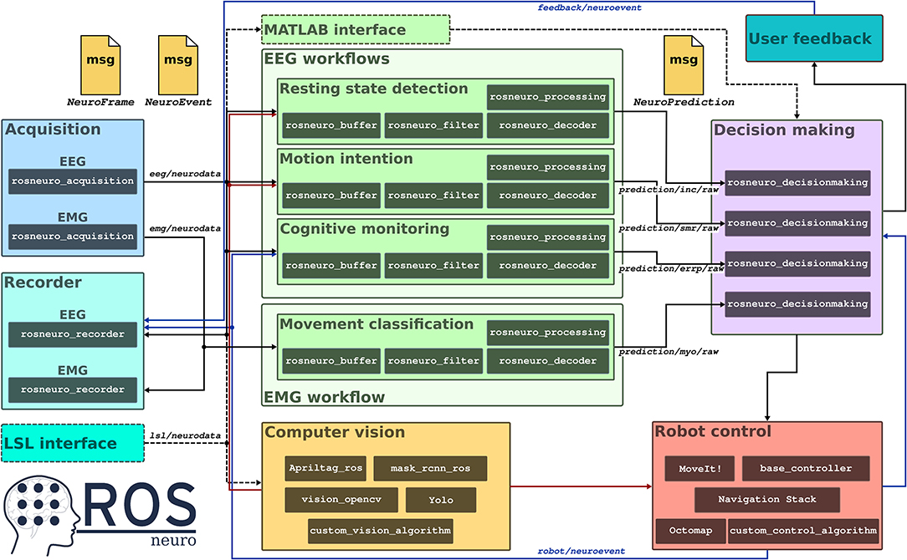

# ROS-Neuro: An Open-Source Platform for Neurorobotics

ROS-Neuro has been designed to represent the first open-source neurorobotic middleware that places human neural interfaces and robotic systems at the same conceptual and implementation level. ROS-Neuro is an extension of ROS that for many years is considered the standard platform for robotics. One of the strengths of ROS is its modularity and the possibility for different research groups to develop stand-alone components all relying on the same standard communication infrastructure. A similar requirement is a cornerstone for the workflow of any closed-loop neural interface where—for instance—acquisition, processing, and decoding methods should run in parallel in order to provide a continuous/discrete control signal to drive the robotic device. 

